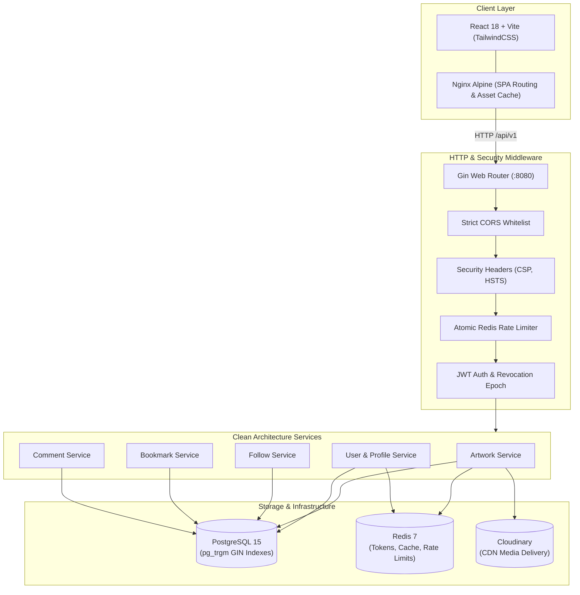

# Lumiina

[](https://github.com/Nyanns/lumiina/actions/workflows/ci.yml)
[](https://github.com/Nyanns/lumiina/actions/workflows/codeql.yml)
[](https://goreportcard.com/report/github.com/Nyanns/lumiina)
[](https://go.dev/)
[](https://react.dev/)
[](https://www.docker.com/)
[](LICENSE)

Lumiina is a modern anime art sharing and discovery platform inspired by Pixiv and ArtStation. Built with a performance-focused Go backend and a responsive React frontend, Lumiina emphasizes creator ergonomics, authentic digital art curation, and defense-in-depth security.

Official mascots: **Lumi** & **Ina**.

---

## 🎨 Product Features & Creator Experience

- **Curated Discovery Feeds**:
  - Dual-axis homepage featuring daily engagement carousels and an organic Masonry grid.
  - Dedicated galleries for **Trending** and **Recommended** artworks (`/trending`, `/recommended`) with real-time tag filters and 48-item batch pagination.
- **Digital Artist Studio Tools (`/upload`)**:
  - **Value Check Mode (明度/Grayscale)**: Instant high-contrast monochrome preview to audit light-to-shadow values before publication.
  - **Feed Crop Simulator**: 1:1 square preview with top, center, and bottom focal point anchoring.
  - **Harmonic Palette Extractor**: Automatic canvas extraction of 5 dominant HEX color codes from uploaded artwork.
  - **Studio Backdrop Switcher**: Preview illustrations against 18% Neutral Gray, OLED Deep Dark, Pure White, or Alpha Checkerboard.
  - **1:1 Native Resolution Inspector**: Full-screen modal for pixel-level lineart and brush texture inspection.
- **Social & Community Interaction**:
  - **Follow & Unfollow System**: End-to-end user subscriptions with optimistic UI updates and synchronized live follower counts.
  - **Followers & Following Modal**: Interactive list modal on artist profiles with instant follow action toggles.
  - **Pixiv-Style Bookmarks**: Ribbon collection system with a dedicated "Bookmarks" tab on user profiles (`/profile/:username?tab=bookmarks`).
  - **Discussion Threads**: Compact, left-aligned comment section with author deletion controls and stored XSS sanitization.
- **Entity Obfuscation & Vanity URLs**:
  - Sequential database IDs are shielded using Sqids-based HashID strings (`/artworks/H1rJsY`).
  - Canonical creator profiles use case-insensitive vanity handles (`/profile/Nyanns`).
- **Human-Crafted Visual Standard**:
  - Built strictly on clean slate surfaces, 1px tactile borders, and Pixiv Sky Blue (`#0096fa`) accents.
  - Zero glassmorphism blur soup; content-first typography using **Inter** paired with native Japanese CJK font fallbacks (`Hiragino Sans`, `Yu Gothic UI`, `Meiryo`).

---

## 🏛️ System Architecture



---

## 🛠️ Tech Stack

### Backend
- **Language**: Go 1.24+
- **HTTP Framework**: [Gin](https://github.com/gin-gonic/gin)
- **Database & ORM**: PostgreSQL 15/16 with `pg_trgm`, [GORM](https://gorm.io/)
- **In-Memory Store**: Redis 7 (atomic rate limiting via Lua, ephemeral tokens, cache)
- **Object Storage**: Cloudinary SDK (with magic bytes MIME sniffing)
- **ID Obfuscation**: [Sqids](https://sqids.org/go)
- **Observability**: Go `log/slog` structured logging, `X-Request-ID` tracing, Prometheus `/metrics`
- **Documentation**: OpenAPI 2.0 / Swagger ([swaggo/swag](https://github.com/swaggo/swag))

### Frontend
- **Framework**: React 18, [Vite](https://vitejs.dev/)
- **Styling**: [TailwindCSS](https://tailwindcss.com/)
- **Animations**: [Framer Motion](https://www.framer.com/motion/)
- **Icons**: [Lucide React](https://lucide.dev/)
- **Typography**: Inter (Latin) with Japanese CJK font fallbacks
- **Production Server**: Nginx Alpine with gzip compression and static cache headers

---

## 🛡️ Enterprise Security & Hardening Highlights

1. **Timing-Attack Resilient Authentication**:
   - In non-existent user login attempts, a pre-computed bcrypt canary hash is evaluated in constant time (~70ms) to prevent username enumeration.
2. **Atomic Sliding Window Rate Limiting**:
   - Single round-trip Redis Lua script enforcing limits with standard RFC headers (`X-RateLimit-Remaining`, `Retry-After`).
3. **Session Revocation Epoch**:
   - Password reset immediately sets a revocation timestamp in Redis. The authentication middleware rejects active JWTs issued prior to that epoch (`iat < epoch`).
4. **Input Sanitization & Magic Bytes**:
   - Artwork and avatar uploads inspect file headers via `http.DetectContentType` to prevent malicious payloads masked with image extensions.
   - Text submissions undergo HTML escaping (`html.EscapeString`) to stop Stored XSS.
5. **Fail-Fast Configuration**:
   - Startup verification (`cfg.Validate()`) halts execution immediately if mandatory secrets (e.g. `JWT_SECRET` < 32 characters, invalid Cloudinary prefixes) are missing or misconfigured.
6. **Optimized Query Performance**:
   - GIN Trigram indexes enable ultra-fast substring searches (`ILIKE`) without sequential table scans.
   - Batch query resolvers (`populateLikeCounts`, `populateUserLikeStatus`, `BatchCheckFollowing`) eliminate N+1 database queries across feeds and profile collections.

---

## 📚 Documentation & Engineering Runbooks

- **[Architecture Decision Records (ADRs)](docs/adr/)**: Architectural rationale, trade-offs, and design choices.
  - [ADR 0001: Record Architecture Decisions](docs/adr/0001-record-architecture-decisions.md)
  - [ADR 0002: Clean Architecture and Dependency Inversion](docs/adr/0002-clean-architecture-and-dependency-inversion.md)
  - [ADR 0003: Redis Atomic Rate Limiting & Ephemeral Tokens](docs/adr/0003-redis-atomic-rate-limiting-and-ephemeral-tokens.md)
  - [ADR 0004: PostgreSQL Trigram GIN Indexes for Substring Search](docs/adr/0004-postgresql-trigram-gin-indexes-for-search.md)
- **[Deployment Runbook](docs/DEPLOYMENT.md)**: Production container deployment and cloud readiness checks.
- **[Troubleshooting Guide](docs/TROUBLESHOOTING.md)**: Diagnostic steps for database connection, fail-fast aborts, CORS, and Cloudinary.
- **[Error Handling Specification](docs/ERROR_HANDLING.md)**: Standardized RFC 7807-inspired JSON error envelopes and status code mappings.
- **[Contributing Guidelines](CONTRIBUTING.md)**: Gitflow branching strategy, Conventional Commits, and PR checklists.

---

## 🚀 Getting Started

### Prerequisites
- [Docker](https://docs.docker.com/get-docker/) & Docker Compose
- *Optional for native development*: Go 1.24+, Node.js 20+, PostgreSQL 15+, Redis 7+

### 1. Environment Setup
Copy the environment template and provide your Cloudinary and SMTP credentials:
```bash
cp .env.example .env
```

### 2. Run with Docker Compose (Turnkey Full Stack)
Start all services (PostgreSQL, Redis, Go API, and React Web Nginx):
```bash
docker compose up --build
```

Access the application:
- **Frontend Web**: [http://localhost:5173](http://localhost:5173)
- **Backend API**: [http://localhost:8080](http://localhost:8080)
- **Interactive Swagger Docs**: [http://localhost:8080/swagger/index.html](http://localhost:8080/swagger/index.html)
- **Prometheus Metrics**: [http://localhost:8080/metrics](http://localhost:8080/metrics)
- **Health Probes**: [http://localhost:8080/livez](http://localhost:8080/livez) & [http://localhost:8080/readyz](http://localhost:8080/readyz)

To shut down services:
```bash
docker compose down
```

### 3. Native Development (Optional)

#### Backend (Terminal 1)
```bash
# Run migrations & start API server
make run

# Run unit tests with race detection
make test-race
```

#### Frontend (Terminal 2)
```bash
cd web
npm install
npm run dev
```

---

## 📡 API Reference Overview

Base path: `/api/v1`

### Authentication & Account
| Method | Endpoint | Description | Access |
| :--- | :--- | :--- | :---: |
| `POST` | `/api/v1/auth/register` | Register new artist account | Public (Rate-Limited) |
| `POST` | `/api/v1/auth/login` | Authenticate and obtain JWT token | Public (Rate-Limited) |
| `GET` | `/api/v1/auth/verify-email` | Verify email token | Public |
| `POST` | `/api/v1/auth/forgot-password` | Request password reset token | Public (Rate-Limited) |
| `POST` | `/api/v1/auth/reset-password` | Reset password using token | Public (Rate-Limited) |
| `POST` | `/api/v1/auth/logout` | Revoke session and blacklist token | Bearer |

### Artworks & Discovery
| Method | Endpoint | Description | Access |
| :--- | :--- | :--- | :---: |
| `GET` | `/api/v1/artworks` | Paginated feed with title search & tag filter | Public |
| `GET` | `/api/v1/artworks/trending` | Artworks ranked by engagement velocity | Public |
| `GET` | `/api/v1/artworks/recommended` | Personalized discovery feed | Public |
| `GET` | `/api/v1/artworks/:id` | Artwork details by numeric ID or HashID | Public |
| `POST` | `/api/v1/artworks` | Upload illustration (`multipart/form-data`) | Bearer |
| `PUT` | `/api/v1/artworks/:id` | Update title, description, or tags | Bearer (Owner) |
| `DELETE` | `/api/v1/artworks/:id` | Delete artwork | Bearer (Owner/Admin) |

### Social Engagement & Collections
| Method | Endpoint | Description | Access |
| :--- | :--- | :--- | :---: |
| `POST` | `/api/v1/artworks/:id/like` | Toggle artwork like | Bearer |
| `GET` | `/api/v1/artworks/:id/like-status` | Get like status for current user | Public / Bearer |
| `POST` | `/api/v1/artworks/:id/bookmark` | Toggle artwork bookmark | Bearer |
| `GET` | `/api/v1/artworks/:id/bookmark-status` | Get bookmark status for current user | Public / Bearer |
| `GET` | `/api/v1/users/:id/bookmarks` | Get artist's bookmarked collection | Public |
| `POST` | `/api/v1/users/:id/follow` | Toggle follow relationship | Bearer |
| `GET` | `/api/v1/users/:id/follow-status` | Check if following a creator | Bearer |
| `GET` | `/api/v1/users/:id/followers` | Get followers list | Public |
| `GET` | `/api/v1/users/:id/following` | Get creators followed by user | Public |

### Discussions & Profiles
| Method | Endpoint | Description | Access |
| :--- | :--- | :--- | :---: |
| `GET` | `/api/v1/artworks/:id/comments` | List artwork comments | Public |
| `POST` | `/api/v1/artworks/:id/comments` | Post comment | Bearer |
| `DELETE` | `/api/v1/comments/:id` | Delete comment | Bearer (Author/Admin) |
| `GET` | `/api/v1/users/me` | Fetch authenticated user profile | Bearer |
| `PUT` | `/api/v1/users/profile` | Update profile bio, links, and details | Bearer |
| `POST` | `/api/v1/users/avatar` | Upload profile avatar | Bearer |
| `POST` | `/api/v1/users/banner` | Upload profile header banner | Bearer |
| `GET` | `/api/v1/users/search` | Search users by username substring | Public |
| `GET` | `/api/v1/users/:id` | Public profile by ID, handle, or HashID | Public |

---

## 📂 Project Structure

```text
lumiina/
├── .github/workflows/        # Automated CI (lint, race tests, CodeQL SAST)
├── cmd/api/main.go           # Go application entrypoint & dependency injection
├── config/                   # Fail-fast configuration & service initializers
├── db/migrations/            # Up/Down SQL migration sequence (golang-migrate)
├── docs/                     # Generated OpenAPI/Swagger docs & Architecture ADRs
├── internal/
│   ├── handler/              # Gin HTTP request controllers
│   ├── middleware/           # Rate limiting, auth, CORS, security headers, tracing
│   ├── model/                # GORM schemas, JSON serializers, DTOs
│   ├── pkg/                  # Cloudinary, mailer, sanitization, HashID helpers
│   ├── repository/           # Parameterized database queries & batch resolvers
│   └── service/              # Core business logic & security validations
├── web/                      # React 18 frontend (Vite + TailwindCSS + Framer Motion)
│   ├── public/               # Static assets, branding, and mascot illustrations
│   ├── src/
│   │   ├── api/              # Axios HTTP client with auth interceptors
│   │   ├── components/       # UI components (ArtworkCard, Navbar, Modals, Lightbox)
│   │   ├── context/          # Auth, Theme, Likes, Bookmarks, and Follow providers
│   │   ├── pages/            # Multi-page views (Feed, Discovery, Upload, Legal, Profile)
│   │   └── App.jsx           # Client-side routing configuration
│   ├── Dockerfile            # Multi-stage production container (Nginx Alpine)
│   └── nginx.conf            # SPA routing fallback and cache directives
├── Dockerfile                # Multi-stage production container for Go API
├── docker-compose.yml        # Full-stack local development & deployment stack
└── Makefile                  # Automation commands for build, test, and linting
```

---

## 📄 License

Distributed under the MIT License. See [LICENSE](LICENSE) for details.
