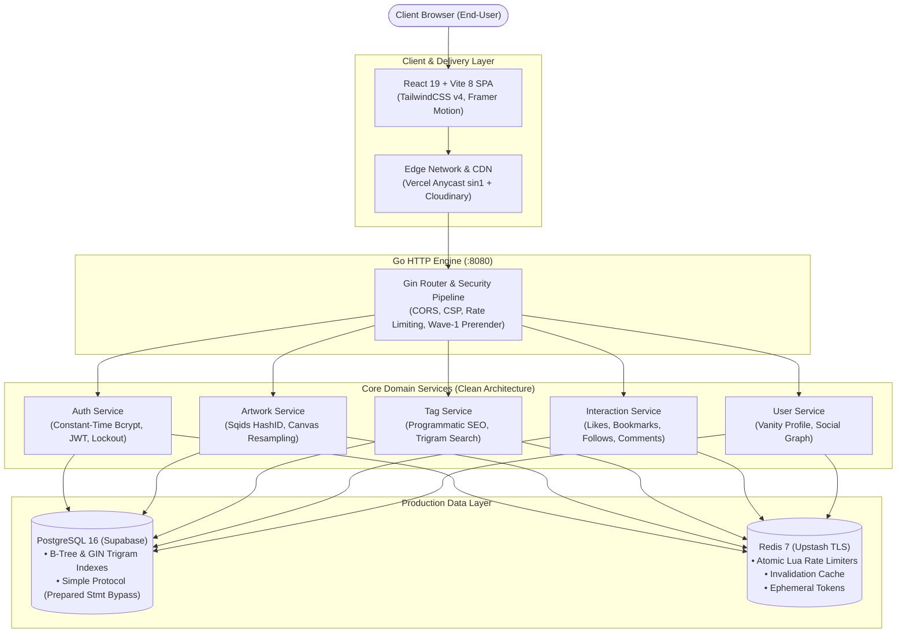
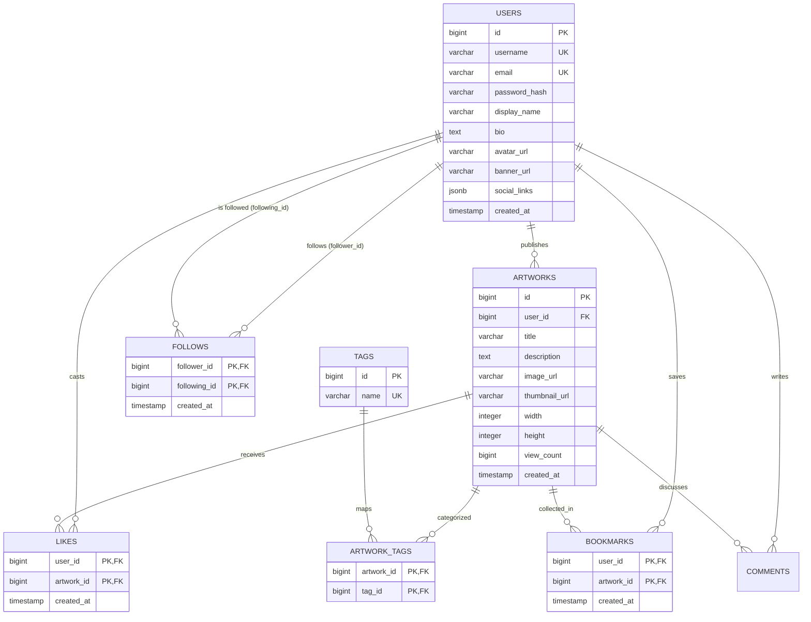
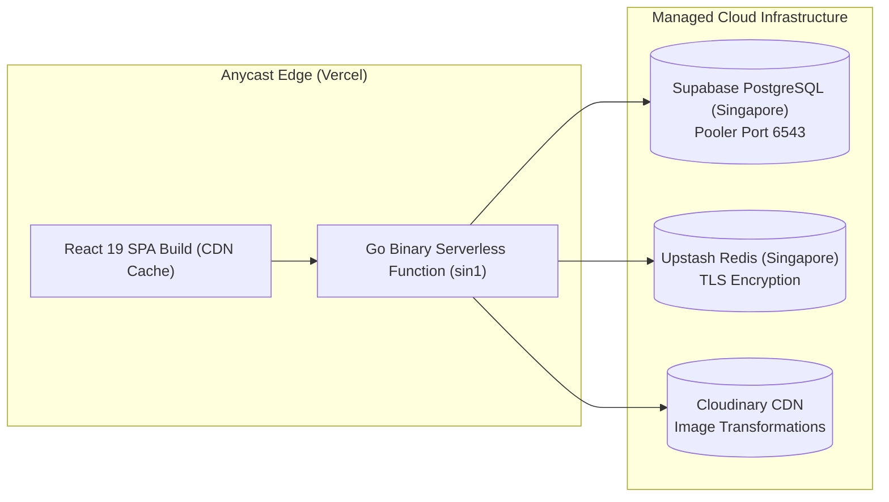

# Lumiina

[](https://github.com/Nyanns/lumiina/actions/workflows/ci.yml)
[](https://github.com/Nyanns/lumiina/actions/workflows/codeql.yml)
[](https://goreportcard.com/report/github.com/Nyanns/lumiina)
[](https://go.dev/)
[](https://react.dev/)
[](https://vitejs.dev/)
[](https://tailwindcss.com/)
[](https://www.docker.com/)
[](LICENSE)

> **A production-oriented software system for digital artists, engineered with Clean Architecture, defense-in-depth API security, and high-throughput asset delivery.**

---

## Table of Contents

- [What is Lumiina?](#what-is-lumiina)
- [Live Demo](#live-demo)
- [Architecture](#architecture)
- [Tech Stack](#tech-stack)
- [Repository Structure](#repository-structure)
- [Local Development](#local-development)
- [Environment Variables](#environment-variables)
- [API Overview](#api-overview)
- [Database Architecture](#database-architecture)
- [Caching Strategy](#caching-strategy)
- [Security](#security)
- [Testing](#testing)
- [Performance](#performance)
- [Deployment](#deployment)
- [Roadmap](#roadmap)

---

## What is Lumiina?

**Lumiina** is an illustration and creator community platform designed for digital artists, illustrators, and visual creators to publish, curate, and discover original artworks. 

Rather than serving as a basic CRUD prototype, Lumiina is engineered as a **production-oriented software system** designed to solve real-world backend and full-stack challenges:
- **Zero-Latency Content Discovery**: Wave-1 server-side bot pre-rendering, programmatic SEO for tags, and Redis edge caching for crawlers.
- **Client-Side Asset Preprocessing**: Canvas GPU downsampling pipeline shrinking 10–20 MB master illustrations to ~800 KB WebP before network transit.
- **Enterprise Defense-in-Depth**: Constant-time Bcrypt canary execution against username enumeration, Redis token revocation epochs, and decompression bomb pre-allocation bounds checks.
- **Platform Mascot & Identity**: Single unified official character guide, **Lumiina** (*"A small light in a big world"*), integrated via an interactive 9-expression sticker engine and editorial design system.

---

## Live Demo

| Environment | Endpoint | Description |
| :--- | :--- | :--- |
| **Official Production** | [https://www.lumiina.art](https://www.lumiina.art) | Primary production domain (Vercel Anycast Edge, Hostinger DNS, Let's Encrypt TLS) |
| **Apex 308 Redirect** | [https://lumiina.art](https://lumiina.art) | Permanent apex redirect to canonical `www.lumiina.art` |

---

## Architecture

Lumiina strictly implements **Clean Layered Architecture (Handler-Service-Repository)** with complete Dependency Inversion.



### Architectural Separation of Concerns
1. **Delivery Layer (`internal/handler`)**: Accepts HTTP requests, enforces strict struct-level DTO validations, decodes Sqids HashIDs, formats RFC 7807 error envelopes, and injects `X-Request-ID` tracing headers.
2. **Business Domain Layer (`internal/service`)**: Implements pure domain rules: password entropy scoring, image dimension bounds validation, follow limits, and tag normalization. Independent of HTTP and database drivers.
3. **Data Access Layer (`internal/repository`)**: Executes parameterized SQL queries via GORM, handles batch resolutions (`IN (?)`) to eliminate N+1 queries, and leverages PostgreSQL GIN Trigram indexes.
4. **Resilience & Storage Layer**: Supabase PostgreSQL with Supavisor transaction pooling, Upstash Redis over TLS for distributed state, and Cloudinary for media storage.

---

## Tech Stack

### Backend
- **Language**: Go 1.24+
- **HTTP Engine**: [Gin Web Framework](https://github.com/gin-gonic/gin)
- **Database & Driver**: PostgreSQL 16 with `pg_trgm`, [GORM](https://gorm.io/) (`pgx/v5` driver)
- **Cache & Rate Limiting**: Redis 7 (atomic Lua scripts, ephemeral token blacklist)
- **Media Processing**: Cloudinary v2 SDK with Magic Bytes MIME sniffing (`http.DetectContentType`)
- **Entity Obfuscation**: [Sqids Go](https://sqids.org/go) (replaces sequential IDs with 6-char URL-safe slugs)
- **Telemetry & Logging**: Standard library `log/slog` structured JSON logging, Prometheus metrics (`/metrics`)
- **API Documentation**: OpenAPI 2.0 / Swagger via [swaggo/swag](https://github.com/swaggo/swag)

### Frontend
- **Framework & Runtime**: React 19, [Vite 8](https://vitejs.dev/) (Rolldown bundler engine)
- **Styling**: [TailwindCSS v4](https://tailwindcss.com/)
- **Micro-Animations**: [Framer Motion v13](https://www.framer.com/motion/)
- **Iconography**: [Lucide React](https://lucide.dev/)
- **PWA Engine**: [vite-plugin-pwa](https://vite-pwa-org.netlify.app/) (Workbox Service Worker, offline cache)
- **Client HTTP Client**: Axios with dynamic bearer interceptors and token synchronization

### Infrastructure & Deployment
- **Edge Anycast**: Vercel Global Edge Network (Region `sin1` - Singapore)
- **Managed Database**: Supabase PostgreSQL (Singapore AWS Region)
- **Managed Cache**: Upstash Redis Serverless (Singapore Region)
- **DNS & SSL**: Hostinger DNS, Automated Let's Encrypt TLS/SSL certificates

---

## Repository Structure

```text
lumiina/
├── .github/workflows/        # Automated CI gates: golangci-lint, race detector, CodeQL SAST
├── cmd/api/main.go           # Application entrypoint & dependency injection wiring
├── config/                   # Fail-fast configuration validator & service initializers
├── db/migrations/            # Up/Down SQL migration sequence (golang-migrate)
├── docs/                     # Generated OpenAPI/Swagger docs & Architecture ADRs
│   ├── adr/                  # Architecture Decision Records (ADR 0001 - 0004)
│   ├── DEPLOYMENT.md         # Production deployment & cloud migration runbook
│   └── TROUBLESHOOTING.md    # Operational incident playbooks & debugging guide
├── internal/
│   ├── handler/              # Gin HTTP request controllers (DTO validation, HTTP response)
│   ├── middleware/           # Rate limiting, security headers, auth, tracing, bot pre-renderer
│   ├── model/                # GORM entity schemas, JSON serializers, Sqids slug decoders
│   ├── pkg/                  # Cloudinary, mailer, sanitization, HashID, and IndexNow helpers
│   ├── repository/           # Parameterized SQL database queries & batch resolvers
│   └── service/              # Core business logic, password hashing, and domain rules
├── web/                      # React 19 SPA frontend (Vite 8 + TailwindCSS v4)
│   ├── public/               # Static assets, official mascot WebP illustrations, and PWA manifest
│   ├── src/
│   │   ├── api/              # Axios HTTP client with unified auth interceptors
│   │   ├── components/       # Reusable components (ArtworkCard, Navbar, Modals, Lightbox)
│   │   ├── context/          # Context providers (Auth, Theme, Likes, Bookmarks, Follows)
│   │   ├── pages/            # View pages (Feed, Discovery, Upload, Profile, Legal, About)
│   │   ├── utils/            # Image optimizer canvas pipeline, color extractor, slug helpers
│   │   └── App.jsx           # Client-side router configuration & lazy-loaded routes
│   ├── Dockerfile            # Multi-stage production container for web (Nginx Alpine)
│   └── nginx.conf            # SPA routing fallback and asset caching headers
├── Dockerfile                # Multi-stage production container for Go binary
├── docker-compose.yml        # Turnkey local development stack (PG, Redis, API, Web)
└── Makefile                  # Developer automation (make run, make test-race, make migrate-up)
```

---

## Local Development

### Prerequisites
- [Docker](https://docs.docker.com/get-docker/) & Docker Compose
- *Optional for bare-metal execution*: Go 1.24+, Node.js 20+, PostgreSQL 16+, Redis 7+

### 1. Turnkey Stack (Docker Compose)
Run the entire production stack (Go API, PostgreSQL, Redis, React SPA, Nginx) with a single command:
```bash
# 1. Clone repository
git clone https://github.com/Nyanns/lumiina.git
cd lumiina

# 2. Copy environment template
cp .env.example .env

# 3. Spin up full stack
docker compose up --build
```
Access the application:
- **Web Application**: `http://localhost:5173`
- **Backend API**: `http://localhost:8080`
- **Swagger Documentation**: `http://localhost:8080/swagger/index.html`
- **Health Probes**: `http://localhost:8080/livez` & `http://localhost:8080/readyz`

### 2. Bare-Metal Development

#### Backend Server
```bash
# Apply migrations to local PostgreSQL
make migrate-up

# Start API server
make run

# Run unit and race tests
make test-race
```

#### Frontend Web
```bash
cd web
npm install
npm run dev
```

---

## Environment Variables

Lumiina enforces **Fail-Fast Configuration** (`config/config.go`). The server halts immediately at startup if critical variables are missing or insecure.

| Variable | Description | Required | Default / Example |
| :--- | :--- | :---: | :--- |
| `APP_ENV` | Application environment (`development`, `staging`, `production`) | No | `development` |
| `PORT` | API server listening port | No | `8080` |
| `DB_HOST` | PostgreSQL host | Yes | `localhost` / Supabase pooler host |
| `DB_PORT` | PostgreSQL port | Yes | `5432` / `6543` (transaction pooler) |
| `DB_USER` | PostgreSQL user | Yes | `postgres` |
| `DB_PASSWORD` | PostgreSQL password | Yes | `<secret>` |
| `DB_NAME` | PostgreSQL database name | Yes | `lumiina` |
| `DB_SSLMODE` | SSL Mode (`disable`, `require`, `verify-full`) | No | `disable` (`require` in prod) |
| `REDIS_HOST` | Redis host | Yes | `localhost:6379` / Upstash endpoint |
| `REDIS_PASSWORD` | Redis password | No | `<secret>` |
| `REDIS_USE_TLS` | Enforce TLS over Redis connection | No | `false` (`true` for Upstash) |
| `JWT_SECRET` | Secret key for HS256 JWT tokens (Min. 32 characters) | Yes | `<high-entropy-string-32-chars+>` |
| `JWT_TTL_HOURS` | Access token lifespan in hours | No | `72` |
| `CLOUDINARY_CLOUD_NAME` | Cloudinary account cloud name | Yes | `lumiina-cloud` |
| `CLOUDINARY_API_KEY` | Cloudinary public API key | Yes | `<api-key>` |
| `CLOUDINARY_API_SECRET` | Cloudinary secret API key | Yes | `<api-secret>` |
| `INDEXNOW_KEY` | Secret verification key for instant search engine indexing | No | `<indexnow-key>` |

---

## API Overview

Base path: `/api/v1`

### 1. Authentication & Account
| Method | Endpoint | Description | Auth |
| :--- | :--- | :--- | :---: |
| `POST` | `/api/v1/auth/register` | Register new creator account | Public (15 req/min) |
| `POST` | `/api/v1/auth/login` | Authenticate & issue JWT token | Public (15 req/min) |
| `GET` | `/api/v1/auth/verify-email` | Verify email confirmation token | Public |
| `POST` | `/api/v1/auth/forgot-password` | Request password reset token | Public (Rate-Limited) |
| `POST` | `/api/v1/auth/reset-password` | Execute password reset via token | Public (Rate-Limited) |
| `POST` | `/api/v1/auth/logout` | Revoke active session via Redis blacklist | Bearer |

### 2. Artworks & Discovery
| Method | Endpoint | Description | Auth |
| :--- | :--- | :--- | :---: |
| `GET` | `/api/v1/artworks` | Paginated feed with title search & tag filter | Public |
| `GET` | `/api/v1/artworks/trending` | Artworks ranked by engagement velocity | Public |
| `GET` | `/api/v1/artworks/recommended` | Personalized discovery feed | Public |
| `GET` | `/api/v1/artworks/:id` | Artwork details by ID or HashID slug | Public |
| `POST` | `/api/v1/artworks` | Upload illustration (`multipart/form-data`) | Bearer (10 up/min) |
| `PUT` | `/api/v1/artworks/:id` | Update title, description, or tags | Bearer (Owner) |
| `DELETE` | `/api/v1/artworks/:id` | Soft-delete artwork | Bearer (Owner/Admin) |

### 3. Interactions & Social Graph
| Method | Endpoint | Description | Auth |
| :--- | :--- | :--- | :---: |
| `POST` | `/api/v1/artworks/:id/like` | Toggle artwork like | Bearer |
| `GET` | `/api/v1/artworks/:id/like-status` | Get like status for current user | Public / Bearer |
| `POST` | `/api/v1/artworks/:id/bookmark` | Toggle artwork bookmark | Bearer |
| `GET` | `/api/v1/artworks/:id/bookmark-status` | Get bookmark status for current user | Public / Bearer |
| `GET` | `/api/v1/users/:id/bookmarks` | Fetch creator's bookmarked collection | Public |
| `POST` | `/api/v1/users/:id/follow` | Toggle follow relationship | Bearer |
| `GET` | `/api/v1/users/:id/followers` | Get creator followers list | Public |
| `GET` | `/api/v1/users/:id/following` | Get creators followed by user | Public |

### 4. Community & Profiles
| Method | Endpoint | Description | Auth |
| :--- | :--- | :--- | :---: |
| `GET` | `/api/v1/artworks/:id/comments` | List artwork comments with sticker parsing | Public |
| `POST` | `/api/v1/artworks/:id/comments` | Post comment (XSS sanitized) | Bearer |
| `DELETE` | `/api/v1/comments/:id` | Delete comment | Bearer (Author/Artwork Owner) |
| `GET` | `/api/v1/users/me` | Fetch authenticated user profile | Bearer |
| `PUT` | `/api/v1/users/profile` | Update profile bio, links, and vanity details | Bearer |
| `POST` | `/api/v1/users/avatar` | Upload avatar (Canvas cropped) | Bearer |
| `POST` | `/api/v1/users/banner` | Upload profile header banner | Bearer |
| `GET` | `/api/v1/users/:id` | Public profile by ID, handle, or HashID | Public |

### 5. Probes, SEO & Bot Infrastructure
| Method | Endpoint | Description | Auth |
| :--- | :--- | :--- | :---: |
| `GET` | `/sitemap.xml` | Dynamic XML Sitemap with Google Image extensions | Public (Redis cached) |
| `GET` | `/robots.txt` | Crawler policies for GoogleBot, GPTBot, ClaudeBot | Public |
| `GET` | `/llms.txt` | Machine-readable context for AI search agents | Public |
| `GET` | `/livez` | Server liveness probe | Public |
| `GET` | `/readyz` | Opaque dependency readiness probe (PostgreSQL & Redis) | Public |
| `GET` | `/metrics` | Prometheus telemetry (Protected: 404 in production) | Internal |

---

## Database Architecture

### Entity Relationship Model (PostgreSQL 16)



### Indexing & Performance Optimizations
1. **GIN Trigram Fuzzy Search**:
   - Extension `pg_trgm` applied on `artworks.title` (`idx_artworks_title_trgm`) and `users.username` (`idx_users_username_trgm`).
   - Enables sub-millisecond substring queries (`ILIKE '%query%'`) avoiding sequential table scans.
2. **Composite Unique Constraints**:
   - `follows (follower_id, following_id)` with `CHECK (follower_id <> following_id)` preventing self-follows at database engine level.
   - `likes (user_id, artwork_id)` and `bookmarks (user_id, artwork_id)` guaranteeing data integrity under concurrent requests.
3. **Transaction Pooler Statement Bypass**:
   - Configured GORM postgres driver with `PreferSimpleProtocol: true` to eliminate prepared statement collisions (`SQLSTATE 42P05`) across pooled Supabase Supavisor connections.

---

## Caching Strategy

Lumiina employs a multi-tiered caching model designed to minimize database roundtrips and withstand traffic spikes:

```mermaid
flowchart LR
    Req["Incoming Request"] --> Route{"Is Cacheable?"}
    Route -->|Yes: Sitemap/Public Feed| RCache["Check Redis Cache"]
    Route -->|No: Mutations/Auth| DB["Direct PostgreSQL"]
    
    RCache -->|Hit (O(1))| Return["Instant HTTP Response"]
    RCache -->|Miss| DB
    DB --> Repopulate["Populate Redis with TTL"]
    Repopulate --> Return
```

1. **Redis Cache-Aside Pattern**:
   - Public discovery feeds and XML Sitemaps (`seo:sitemap_xml:v2`) are cached with 30-minute TTLs.
2. **Synchronous Cache Invalidation (`internal/pkg/cache/invalidator.go`)**:
   - Any artwork creation, update, or deletion synchronously purges associated feed caches and tag aggregations across patterns `artworks:feed:*` and `tags:popular`.
3. **Atomic Lua Rate Limiting**:
   - Rate limit counters execute in a single round-trip Redis Lua script, maintaining rolling window counters without race conditions.
4. **Session Revocation Epochs**:
   - Resetting passwords writes a revocation timestamp key `user_revocation:<user_id>`. JWT verification checks this epoch in $O(1)$ memory time, invalidating older tokens immediately without database writes.

---

## Security

Lumiina enforces an enterprise **Defense-in-Depth** security posture across 7 hardened vectors:

1. **Anti-Enumeration Canary Evaluation**:
   - When authenticating a non-existent username, a pre-computed Bcrypt canary hash is evaluated in constant time (~70ms) to ensure response times do not leak user existence.
2. **Pixel Flood / Decompression Bomb Defense**:
   - Image uploads inspect image header dimensions via `image.DecodeConfig` before allocating uncompressed RGBA pixel buffers in memory. Images exceeding 10,000 × 10,000 px are rejected immediately.
3. **Magic Bytes Content-Type Sniffing**:
   - Files are validated using `http.DetectContentType` on the initial 512-byte header stream, thwarting malicious executables disguised with `.png`/`.jpg` extensions.
4. **Account Lockout Protection**:
   - 5 consecutive failed login attempts trigger an automatic 15-minute account freeze (`AUTH_ACCOUNT_LOCKED` / HTTP 429) backed by Redis TTL counters.
5. **Strict Content Security Policy (CSP)**:
   - Security headers middleware strips `'unsafe-eval'`, locks down frame embedding (`X-Frame-Options: DENY`), and enforces HSTS with preloading headers.
6. **Opaque Infrastructure Probes**:
   - `/readyz` returns a sanitized status envelope (`{"status":"ready"}`) without leaking internal hostnames, ports, or topology of PostgreSQL and Redis.
7. **Telemetry Port Cloaking**:
   - Prometheus `/metrics` returns HTTP 404 in production to defeat automated endpoint scanners, allowing access exclusively to loopback scrapers (`127.0.0.1`, `::1`).

---

## Testing

```bash
# Run unit and race-condition test suites across all packages
make test-race

# Run linter checks
golangci-lint run ./...
```

- **Race Condition Detection**: All Go test suites are executed with `go test -race ./...` to guarantee 0 data races in concurrent services.
- **Automated CI Quality Gates**: GitHub Actions pipeline runs on every push and PR:
  - Go compiler checks & static analysis.
  - Automated CodeQL SAST scanning (100% resolved alerts for CWE-093, CWE-079, CWE-117).
- **QA Automation Suite (`qa-journey/`)**:
  - Structured against IEEE 829 test specifications and ISTQB test design techniques (Equivalence Partitioning, Boundary Value Analysis).
  - Automated API test suite running via Postman & Newman CLI.
  - End-to-End (E2E) browser automation using Playwright.

---

## Performance

- **Sub-50ms API Latency**: Vercel Serverless Functions aligned to Singapore region (`sin1`), achieving single-digit millisecond latency to Supabase PostgreSQL and Upstash Redis.
- **Client-Side Image Preprocessing**: Canvas downsampling downscales oversized 8K raw files to 2560px WebP at 0.90 quality factor, saving **85% to 95% bandwidth** and reducing upload latency by ~20x.
- **Code-Splitting & Zero CLS**: Route-level dynamic imports (`React.lazy()`) reduced initial entry bundle from 640 kB to **22.07 kB (>93% reduction)**.
- **Zero N+1 Query Resolvers**: Batch queries (`populateLikeCounts`, `populateUserLikeStatus`, `BatchCheckFollowing`) consolidate feed queries into $O(1)$ batch operations via SQL `IN (?)`.
- **Wave-1 Bot Pre-rendering**: Zero-overhead User-Agent sniffing dynamically injects OpenGraph, Twitter Cards, and JSON-LD microdata directly into the initial HTML response for search engine crawlers.

---

## Deployment

Lumiina runs on a distributed cloud topology:



- **Domain Routing**: Apex domain (`https://lumiina.art`) permanently 308-redirects to canonical `https://www.lumiina.art`.
- **Zero-Downtime Deployment**: Continuous deployment wired via Vercel GitHub integration; database migrations managed via `golang-migrate`.
- **Operational Runbooks**: Complete runbooks available in [`docs/DEPLOYMENT.md`](docs/DEPLOYMENT.md) and [`docs/TROUBLESHOOTING.md`](docs/TROUBLESHOOTING.md).

---

## Roadmap

- [x] **Core Gallery Platform**: Clean Architecture Go API, artwork uploads, tagging, and discovery.
- [x] **Social Interactions**: Likes, Bookmarks, and Creator Follow / Unfollow system.
- [x] **Cloud Migration & Production Launch**: Live deployment on `lumiina.art` with Supabase, Upstash, and Vercel.
- [x] **Production Security Hardening**: Defense-in-depth vectors 1–7, account lockout, and timing attack protection.
- [x] **Technical SEO & AI Discovery**: Dynamic XML Sitemaps, Google Image extensions, Wave-1 Bot Pre-renderer, and `llms.txt`.
- [x] **Official Mascot Property & Creator Studio**: Lumiina Character Bible v1.0, 9-expression sticker engine, Showcase Card Studio, and Color Palette Extractor.
- [ ] **QA Automation Suite (Modul 5)**: Comprehensive Playwright E2E automation for live production regression testing.
- [ ] **Real-Time Notification Pipeline**: WebSocket or Server-Sent Events (SSE) for instant interaction notifications.
- [ ] **Solo Capstone Project**: GoAntri — Smart Queue Management System.

---

## License

Distributed under the MIT License. See [LICENSE](LICENSE) for details.
