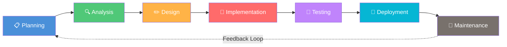
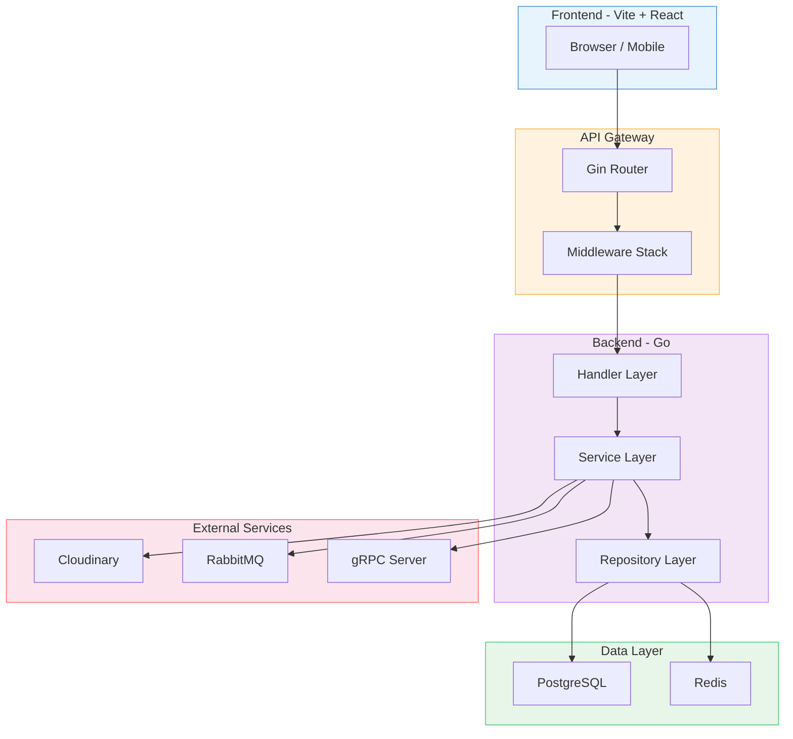
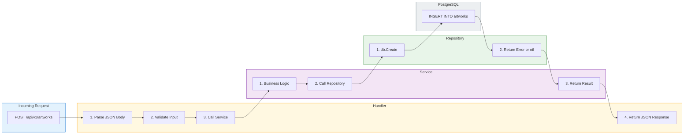
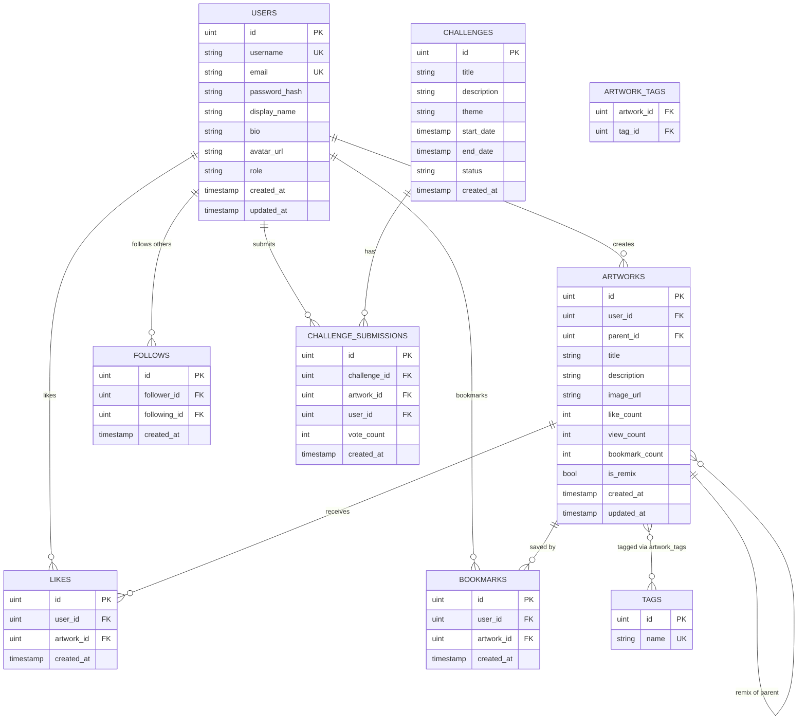
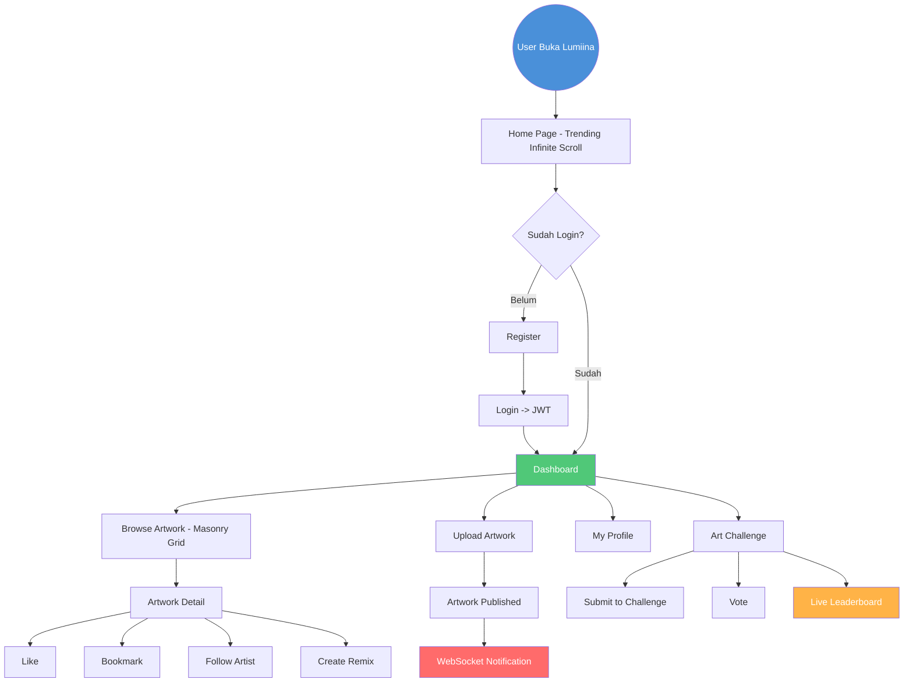
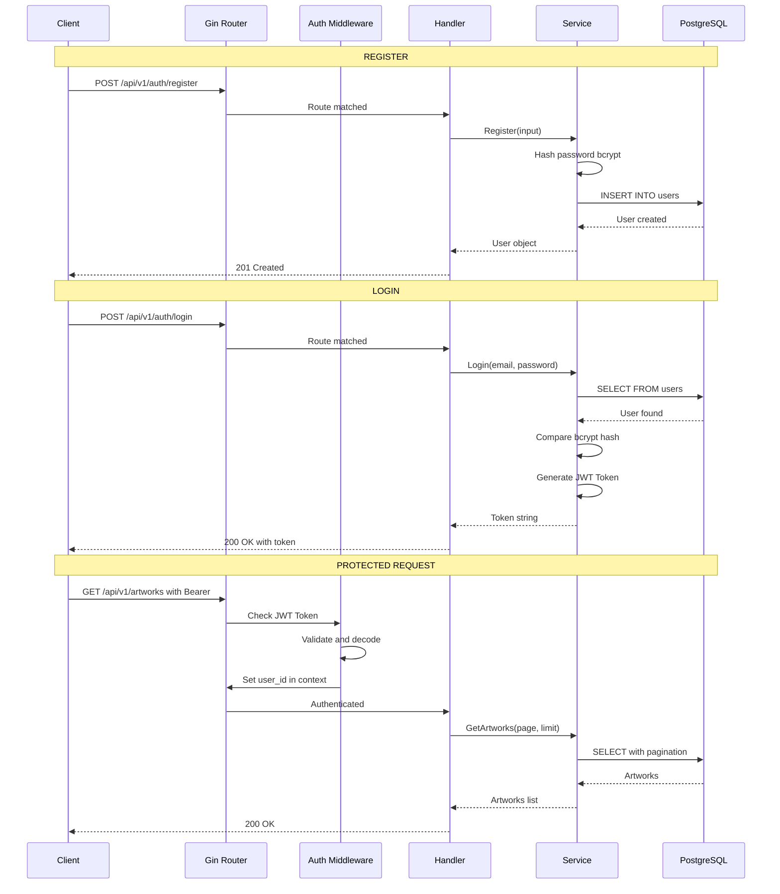
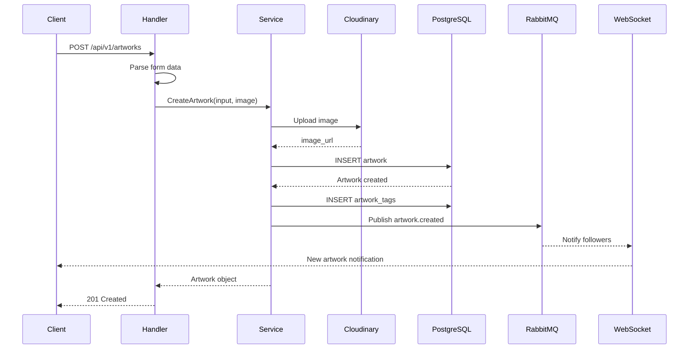
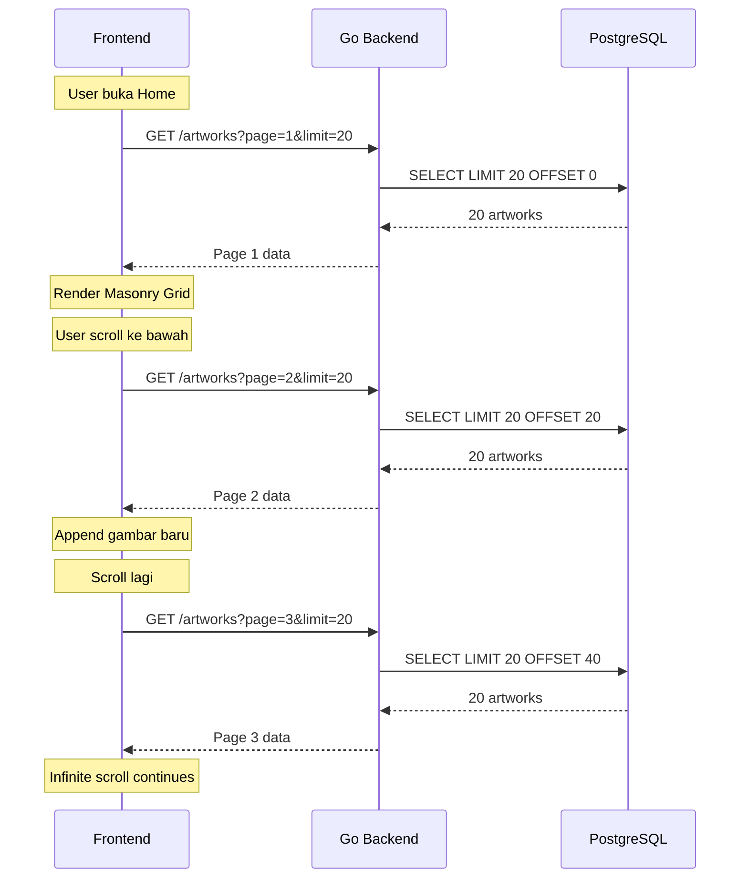
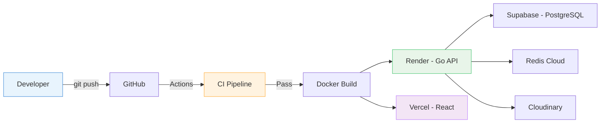

# 🎨 Lumiina — Project Documentation (SDLC)

> **"Your Art, Your World"** — Platform sharing fan art anime yang terinspirasi Pixiv, tapi lebih baik dan unik.
>
> **Mascots**: Lumi & Ina

---

## 📑 Daftar Isi

1. [Pendahuluan](#-1-pendahuluan)
2. [Metodologi SDLC](#-2-metodologi-sdlc)
3. [Phase 1: Planning](#-phase-1-planning)
4. [Phase 2: Analysis — Tech Stack](#-phase-2-analysis--tech-stack)
5. [Phase 3: Design](#-phase-3-design)
6. [Phase 4: Implementation Roadmap](#-phase-4-implementation--sesi-717-roadmap)
7. [Phase 5: Testing Strategy](#-phase-5-testing-strategy)
8. [Phase 6: Deployment](#-phase-6-deployment-plan)
9. [Phase 7: Maintenance](#-phase-7-maintenance)
10. [Professional Practices](#-professional-practices)

---

## 📌 1. Pendahuluan

### 1.1 Latar Belakang

Pixiv adalah platform sharing karya seni digital terbesar di Jepang. Namun, UI/UX-nya terasa kuno dan kurang intuitif bagi pengguna internasional. **Lumiina** hadir sebagai alternatif modern yang mengambil inspirasi terbaik dari Pixiv, lalu menambahkan fitur-fitur unik yang belum ada di platform manapun.

### 1.2 Tujuan Proyek

1. Membangun platform sharing fan art anime full-stack yang profesional.
2. Mengimplementasikan arsitektur backend Go yang scalable dan maintainable.
3. Menjadi portofolio utama untuk menunjukkan kemampuan Mid-Level Go Backend Developer.

### 1.3 Ruang Lingkup

| Item | Detail |
|---|---|
| **Project Name** | Lumiina |
| **Tagline** | "Your Art, Your World" |
| **Mascots** | Lumi & Ina (karakter original buatan developer) |
| **Type** | Full-stack Web Application |
| **Developer** | Sandi (Backend) + AI (Frontend) |
| **Timeline** | Sesi 7-17 (masing-masing 1 teknologi) |
| **Target User** | Artist (upload karya) & Viewer (browse, like, follow) |

### 1.4 Stakeholder

| Peran | Nama | Tanggung Jawab |
|---|---|---|
| Backend Developer | Sandi | Go API, Database, Auth, Infra |
| Frontend Developer | AI Assistant | React UI, Animasi, Integrasi API |
| Designer | Sandi + AI | Logo, Branding, UI/UX Direction |

---

## 🔄 2. Metodologi SDLC

Proyek Lumiina menggunakan metodologi **Iterative & Incremental Development** yang dikombinasikan dengan pendekatan **Agile**. Setiap sesi (Sesi 7-17) merepresentasikan satu *Sprint* yang berfokus pada satu teknologi baru.



### 2.1 Siklus Hidup Proyek

| Phase | Aktivitas | Output |
|---|---|---|
| **Planning** | Identifikasi kebutuhan, fitur MVP, fitur unik | Project Charter, Feature List |
| **Analysis** | Pemilihan tech stack, analisis risiko | Tech Stack Matrix, Risk Register |
| **Design** | Arsitektur, ERD, API contract, UI wireframe | Architecture Diagram, ERD, API Spec |
| **Implementation** | Coding per sesi (1 sesi = 1 teknologi) | Source Code, Git History |
| **Testing** | Unit test, integration test, manual test | Test Reports, Coverage Report |
| **Deployment** | Containerize, CI/CD, deploy ke cloud | Docker Images, Live URL |
| **Maintenance** | Bug fix, v2 features, monitoring | Changelog, Issue Tracker |

### 2.2 Sprint Schedule (Sesi 7-17)

| Sprint | Sesi | Teknologi | Deliverable |
|--------|------|-----------|-------------|
| Sprint 1 | 7 | DB Relations | Model, Relasi, Pagination |
| Sprint 2 | 8 | Auth | Register, Login, JWT, RBAC |
| Sprint 3 | 9 | Redis | Cache, Rate Limiting |
| Sprint 4 | 10 | Testing | Unit Test, Mocking |
| Sprint 5 | 11 | WebSocket | Real-time Notification |
| Sprint 6 | 12 | Goroutines + Upload | File Upload, Background Processing |
| Sprint 7 | 13 | Docker | Containerize Stack |
| Sprint 8 | 14 | Swagger + CI/CD | API Docs, GitHub Actions |
| Sprint 9 | 15 | RabbitMQ | Async Job Processing |
| Sprint 10 | 16 | gRPC | Internal Microservice |
| Sprint 11 | 17 | Polish + Deploy | Frontend, Integration, Go Live |

---

## 📋 Phase 1: Planning

### 1.1 Core Features (MVP)

- [x] User registration & authentication (Artist / Viewer)
- [x] Upload artwork dengan metadata (title, description, tags)
- [x] Browse & search artwork (by tag, by artist, trending)
- [x] Like, bookmark, dan follow system
- [x] Artist profile page dengan portfolio
- [x] Pagination & infinite scroll

### 1.2 Unique Features (Differentiator dari Pixiv)

| Fitur | Deskripsi | Teknologi yang Digunakan |
|---|---|---|
| 🎯 **Art Challenge** | Kontes mingguan bertema dengan leaderboard real-time & badge pemenang | Redis (leaderboard), WebSocket (live votes), Scheduled Jobs |
| 🔗 **Remix Tree** | Visual rantai inspirasi karya turunan (Obsidian-like graph node) | Graph Relationships (parent-child), gRPC, React Flow / D3.js |

### 1.3 Out of Scope (v2 Backlog)

| Fitur | Deskripsi | Prioritas |
|---|---|---|
| 🛒 Komisi System | Marketplace jasa gambar custom | Medium |
| ⏳ Ephemeral Exhibition | Pameran sementara (Redis TTL + FOMO) | Low |
| 🎨 Color Palette Extraction | Search by color dominan (image processing) | Low |

### 1.4 Risk Analysis

| Risiko | Dampak | Mitigasi |
|---|---|---|
| Database schema berubah di tengah development | Tinggi | Gunakan golang-migrate (versioned migrations) |
| Cloudinary quota habis | Medium | Limit upload size, compress sebelum upload |
| Performance lambat saat data besar | Tinggi | Redis cache, pagination, DB indexing |
| WebSocket connection drop | Medium | Reconnect logic di frontend |

---

## 🔍 Phase 2: Analysis — Tech Stack

### 2.1 Backend (Sandi Bangun Sendiri)

| Layer | Technology | Versi | Alasan |
|---|---|---|---|
| Language | Go | 1.21+ | Performa tinggi, concurrency native |
| Framework | Gin | v1.9+ | Lightweight, battle-tested, middleware ecosystem |
| ORM | GORM | v2 | Relasi kompleks, migration, preloading |
| Database | PostgreSQL | 15 | Relational DB terbaik untuk data terstruktur |
| Cache | Redis | 7 | Leaderboard, trending, session, TTL |
| Auth | JWT + Bcrypt | golang-jwt/jwt/v5 | Stateless authentication industri standar |
| Real-time | WebSocket | gorilla/websocket | Notifikasi & live vote |
| Message Queue | RabbitMQ | 3.x | Async processing (notif, cleanup) |
| Microservice | gRPC + Protobuf | - | Internal Remix Tree service |
| File Storage | Cloudinary | - | CDN untuk gambar artwork |
| API Docs | Swagger | swaggo/swag | Auto-generated API documentation |
| Testing | testify + mockery | - | Unit test + mocking |
| Linter | golangci-lint | - | Jaga kualitas kode |
| Migration | golang-migrate | - | Database versioning profesional |
| Config | godotenv | - | Environment variable management |

### 2.2 Frontend (AI Build)

| Technology | Alasan |
|---|---|
| Vite + React | Build tool tercepat + library UI terpopuler |
| TailwindCSS | Utility-first CSS, rapid development |
| Framer Motion | Animasi smooth tanpa berat |

### 2.3 Infrastructure

| Technology | Alasan |
|---|---|
| Docker & Docker Compose | Containerize semua services |
| GitHub Actions | CI/CD pipeline |
| Render | Deploy Go API |
| Supabase | Managed PostgreSQL |
| Cloudinary | CDN gambar |
| Vercel | Deploy Frontend |

### 2.4 Frontend Design Preferences

| Aspek | Keputusan |
|---|---|
| Theme | **Light Mode** (terinspirasi Pixiv), BUKAN dark mode |
| Layout | Masonry Grid (ukuran organik seperti Pinterest) |
| Scroll | Infinite Scroll (backend: cursor/offset pagination) |
| Loading | Skeleton Loading (bukan spinner/teks "Loading...") |
| Hover | Micro-interactions via Framer Motion (scale 1.02x, overlay) |
| Glassmorphism | DILARANG (terlihat AI-slop) |
| Desain | Human-crafted, bersih, performa cepat |

---

## ✏️ Phase 3: Design

### System Architecture



### Clean Architecture Flow



### Database Schema (ERD)



### Database Relations

| Relasi | Tipe | Penjelasan |
|---|---|---|
| User -> Artwork | **One-to-Many** | Satu user bisa membuat banyak artwork |
| Artwork <-> Tag | **Many-to-Many** | Join table: `artwork_tags` |
| User -> Like -> Artwork | **Many-to-Many (via junction)** | User bisa like banyak artwork |
| User -> Bookmark -> Artwork | **Many-to-Many (via junction)** | User bisa bookmark banyak artwork |
| User -> Follow -> User | **Self-referencing Many-to-Many** | `follower_id` -> `following_id` |
| Artwork -> Artwork (parent) | **Self-referencing One-to-Many** | Remix dari artwork lain |
| Challenge -> Submission | **One-to-Many** | Satu challenge punya banyak submission |
| User -> Submission | **One-to-Many** | Satu user bisa submit ke banyak challenge |

### User Flow



### Authentication Flow



### Artwork Upload Flow



### Infinite Scroll Flow



### API Endpoints

#### Auth

| Method | Endpoint | Auth | Description |
|--------|----------|------|-------------|
| POST | `/api/v1/auth/register` | No | Register user baru |
| POST | `/api/v1/auth/login` | No | Login, return JWT |
| GET | `/api/v1/auth/me` | Yes | Get current user profile |

#### Users

| Method | Endpoint | Auth | Description |
|--------|----------|------|-------------|
| GET | `/api/v1/users/:username` | No | Get user profile |
| PUT | `/api/v1/users/:username` | Yes | Update profile |
| POST | `/api/v1/users/:username/follow` | Yes | Follow user |
| DELETE | `/api/v1/users/:username/follow` | Yes | Unfollow user |
| GET | `/api/v1/users/:username/artworks` | No | Get user artworks |
| GET | `/api/v1/users/:username/followers` | No | Get followers |
| GET | `/api/v1/users/:username/following` | No | Get following |

#### Artworks

| Method | Endpoint | Auth | Description |
|--------|----------|------|-------------|
| GET | `/api/v1/artworks` | No | List artworks (paginated) |
| POST | `/api/v1/artworks` | Yes | Upload artwork |
| GET | `/api/v1/artworks/:id` | No | Get artwork detail |
| PUT | `/api/v1/artworks/:id` | Yes | Update (owner only) |
| DELETE | `/api/v1/artworks/:id` | Yes | Delete (owner/admin) |
| POST | `/api/v1/artworks/:id/like` | Yes | Like artwork |
| DELETE | `/api/v1/artworks/:id/like` | Yes | Unlike artwork |
| POST | `/api/v1/artworks/:id/bookmark` | Yes | Bookmark artwork |
| DELETE | `/api/v1/artworks/:id/bookmark` | Yes | Unbookmark |
| GET | `/api/v1/artworks/:id/remixes` | No | Get remix tree |
| POST | `/api/v1/artworks/:id/remix` | Yes | Create remix |

#### Tags

| Method | Endpoint | Auth | Description |
|--------|----------|------|-------------|
| GET | `/api/v1/tags` | No | List popular tags |
| GET | `/api/v1/tags/:name/artworks` | No | Artworks by tag |

#### Challenges

| Method | Endpoint | Auth | Description |
|--------|----------|------|-------------|
| GET | `/api/v1/challenges` | No | List challenges |
| GET | `/api/v1/challenges/:id` | No | Challenge detail |
| POST | `/api/v1/challenges` | Admin | Create challenge |
| POST | `/api/v1/challenges/:id/submit` | Yes | Submit artwork |
| POST | `/api/v1/challenges/:id/vote/:sid` | Yes | Vote |
| GET | `/api/v1/challenges/:id/leaderboard` | No | Leaderboard |

#### Feed & Discovery

| Method | Endpoint | Auth | Description |
|--------|----------|------|-------------|
| GET | `/api/v1/feed` | Yes | Personalized feed |
| GET | `/api/v1/trending` | No | Trending artworks |
| GET | `/api/v1/search?q=...` | No | Search |

### API Response Standard

#### Success Response

```json
{
    "status": "success",
    "message": "Artworks fetched successfully",
    "data": [
        {
            "id": 1,
            "title": "Shinobu Fanart",
            "image_url": "https://res.cloudinary.com/...",
            "user": {
                "username": "sandi",
                "avatar_url": "..."
            },
            "tags": [
                {"id": 1, "name": "kimetsu-no-yaiba"},
                {"id": 2, "name": "shinobu"}
            ],
            "like_count": 142,
            "created_at": "2026-08-21T00:00:00Z"
        }
    ],
    "meta": {
        "page": 1,
        "limit": 20,
        "total": 150,
        "total_pages": 8
    }
}
```

#### Error Response

```json
{
    "status": "error",
    "message": "Artwork not found",
    "error": "record not found"
}
```

### Folder Structure

```
lumiina/
├── cmd/
│   └── api/
│       └── main.go
├── internal/
│   ├── model/
│   │   ├── user.go
│   │   ├── artwork.go
│   │   ├── tag.go
│   │   ├── like.go
│   │   ├── bookmark.go
│   │   ├── follow.go
│   │   ├── challenge.go
│   │   └── challenge_submission.go
│   ├── repository/
│   │   ├── user_repository.go
│   │   ├── artwork_repository.go
│   │   └── tag_repository.go
│   ├── service/
│   │   ├── user_service.go
│   │   ├── artwork_service.go
│   │   └── tag_service.go
│   └── handler/
│       ├── user_handler.go
│       ├── artwork_handler.go
│       └── tag_handler.go
├── config/
│   ├── config.go
│   └── database.go
├── pkg/
│   └── response/
│       └── response.go
├── migrations/
├── docs/
│   ├── LUMIINA_PROJECT_DOCUMENTATION.md
│   └── lumiina_logo_hd.jpg
├── Makefile
├── Dockerfile
├── docker-compose.yml
├── .env
├── .env.example
├── .gitignore
├── .golangci.yml
├── README.md
└── go.mod
```

---

## 🔨 Phase 4: Implementation — Sesi 7-17 Roadmap

### Sesi 7: Database Relations & Professional Setup

- [x] Init Go module
- [x] Setup folder structure (Clean Architecture)
- [x] Create Makefile
- [x] Create models: User, Artwork, Tag (GORM relations)
- [x] Config management (.env + godotenv)
- [x] Database connection (GORM + PostgreSQL via Docker)
- [x] AutoMigrate (Code-First schema)
- [ ] Setup Git Flow
- [ ] Setup golangci-lint
- [ ] Create models: Like, Bookmark, Follow
- [ ] Repository layer with Preloading
- [ ] Pagination helper
- [ ] Seed data

### Sesi 8: Authentication (JWT + Bcrypt)

- [ ] Register endpoint
- [ ] Login endpoint
- [ ] Auth Middleware
- [ ] Role-Based Access Control (RBAC)
- [ ] Protected vs Public routes

### Sesi 9: Redis (Caching + Rate Limiting)

- [ ] Redis via Docker
- [ ] Cache popular artworks & trending tags
- [ ] Cache invalidation
- [ ] TTL
- [ ] Rate Limiting

### Sesi 10: Testing (Unit Test + Mocking)

- [ ] Go testing basics
- [ ] Table-driven tests
- [ ] Mocking dengan testify/mock
- [ ] Test coverage 70%+

### Sesi 11: WebSocket (Real-time)

- [ ] WebSocket connection
- [ ] Real-time notification
- [ ] Broadcast
- [ ] Connect/disconnect handling

### Sesi 12: Goroutines & File Upload

- [ ] goroutine, channels, WaitGroup, Mutex
- [ ] Multipart upload
- [ ] Cloudinary integration
- [ ] Background thumbnail resize

### Sesi 13: Docker & Docker Compose

- [ ] Dockerfile (multi-stage build)
- [ ] docker-compose.yml
- [ ] Environment variables

### Sesi 14: Swagger & CI/CD

- [ ] Swagger annotations & docs
- [ ] Swagger UI
- [ ] GitHub Actions

### Sesi 15: RabbitMQ

- [ ] Producer & Consumer
- [ ] Event publishing
- [ ] Dead Letter Queue

### Sesi 16: gRPC

- [ ] Protocol Buffers
- [ ] Unary & Streaming RPC
- [ ] Remix Tree service

### Sesi 17: Polish & Deploy

- [ ] Code review & refactor
- [ ] Frontend build
- [ ] Integration
- [ ] Deploy to production
- [ ] Final testing

---

## 🧪 Phase 5: Testing Strategy

| Level | Tool | Target | Sesi |
|---|---|---|---|
| Unit Test | testing + testify | Service & Repository | Sesi 10 |
| Mocking | testify/mock + mockery | Interface mocking | Sesi 10 |
| Integration | httptest | API Endpoint | Sesi 10 |
| Manual | Postman | Full API flow | Setiap Sesi |
| Load Test | wrk / k6 | Performance | Sesi 17 |

**Target Coverage**: Minimal **70%** untuk Service Layer.

---

## 🚀 Phase 6: Deployment Plan



---

## 🔧 Phase 7: Maintenance

| Aktivitas | Frekuensi | Tool |
|---|---|---|
| Bug tracking | Ongoing | GitHub Issues |
| Dependency update | Bulanan | go get -u |
| Performance monitoring | Ongoing | Render metrics |
| v2 features | Setelah v1 stabil | Backlog |
| Database backup | Otomatis | Supabase |

---

## 🛠️ Professional Practices

### Git Workflow

```mermaid
gitgraph
    commit id: "init: project setup"
    branch develop
    checkout develop
    commit id: "feat: add user model"
    branch feature/auth
    checkout feature/auth
    commit id: "feat: register endpoint"
    commit id: "feat: login endpoint"
    commit id: "feat: auth middleware"
    checkout develop
    merge feature/auth id: "merge: auth feature"
    branch feature/artwork-crud
    checkout feature/artwork-crud
    commit id: "feat: artwork repository"
    commit id: "feat: artwork service"
    commit id: "feat: artwork handler"
    checkout develop
    merge feature/artwork-crud id: "merge: artwork CRUD"
    checkout main
    merge develop id: "release: v1.0.0"
```

| Aspek | Aturan |
|---|---|
| **Branch** | main (production), develop (staging), feature/* (per fitur) |
| **Commit** | Conventional Commits: feat, fix, docs, refactor, test, chore |
| **PR** | Setiap feature branch di-merge ke develop via Pull Request |
| **Review** | Self-review + lint harus pass sebelum merge |

### Code Quality

| Aturan | Detail |
|---|---|
| Linter | golangci-lint wajib pass sebelum commit |
| Naming | Go convention: camelCase (internal), PascalCase (exported) |
| Error Handling | Setiap handler HARUS ada error handling lengkap |
| Response Format | Konsisten: status, message, data, meta |
| Comments | Hanya untuk logika kompleks |

---

> **Document Version**: 1.0
>
> **Last Updated**: 2026-08-21
>
> **Author**: Sandi
>
> **Project Status**: In Development (Sesi 7)
